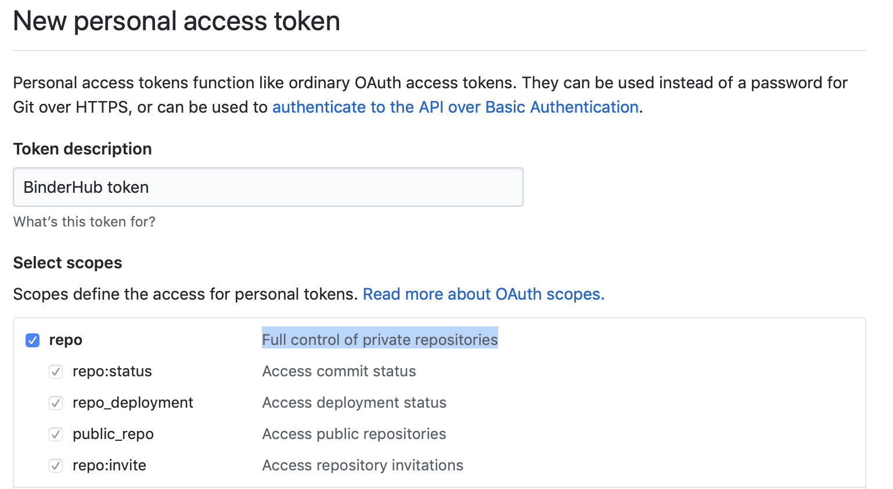

Set up BinderHub
================

BinderHub uses Helm Charts to set up the applications we'll use in our Binder
deployment. If you're curious about what Helm Charts are and how they're
used here, see the `Zero to JupyterHub guide
<https://zero-to-jupyterhub.readthedocs.io/en/latest/tools.html#helm>`_.

Below we'll cover how to configure your Helm Chart, and how to create your
BinderHub deployment.

Preparing to install
--------------------

To configure the Helm Chart we'll need to generate several pieces of
information and insert them into ``yaml`` files.

First we'll create a folder where we'll store our BinderHub configuration
files. You can do so with the following commands::

    mkdir binderhub
    cd binderhub

Now we'll collect the information we need to deploy our BinderHub.
The first is the content of the JSON file created when we set up
the container registry. For more information on getting a registry password, see
:ref:`setup-registry`. We'll copy/paste the contents of this file in the steps
below.

Create two random tokens by running the following commands then copying the
outputs.::

    openssl rand -hex 32
    openssl rand -hex 32

.. note::

   This command is run **twice** because we need two different tokens.

Create ``secret.yaml`` file
---------------------------

Create a file called ``secret.yaml`` and add the following::

  jupyterhub:
    hub:
      services:
        binder:
          apiToken: "<output of FIRST `openssl rand -hex 32` command>"
    proxy:
      secretToken: "<output of SECOND `openssl rand -hex 32` command>"

Next, we'll configure this file to connect with our registry.

If you are using ``gcr.io``
~~~~~~~~~~~~~~~~~~~~~~~~~~~

Add the information needed to connect with the registry to ``secret.yaml``.
You'll need the content in the JSON file that was created when we created
our ``gcr.io`` registry account. Below we show the structure of the YAML you
need to insert. Note that the first line is not indented at all::

  registry:
    url: https://gcr.io
    # below is the content of the JSON file downloaded earlier for the container registry from Service Accounts
    # it will look something like the following (with actual values instead of empty strings)
    # paste the content after `password: |` below
    password: |
      {
      "type": "<REPLACE>",
      "project_id": "<REPLACE>",
      "private_key_id": "<REPLACE>",
      "private_key": "<REPLACE>",
      "client_email": "<REPLACE>",
      "client_id": "<REPLACE>",
      "auth_uri": "<REPLACE>",
      "token_uri": "<REPLACE>",
      "auth_provider_x509_cert_url": "<REPLACE>",
      "client_x509_cert_url": "<REPLACE>"
      }

.. tip::

   * The content you put just after ``password: |`` must all line up at the same
     tab level.
   * Don't forget the ``|`` after the ``password:`` label.

If you are using Docker Hub
~~~~~~~~~~~~~~~~~~~~~~~~~~~

Update ``secret.yaml`` by entering the following::

  registry:
    username: <docker-id>
    password: <password>

.. note::

   * ``<docker-id>`` and ``<password>`` are your credentials to login to Docker Hub.
     If you use an organization to store your Docker images, this account must be a member of it.

If you are using Azure Container Registry
~~~~~~~~~~~~~~~~~~~~~~~~~~~~~~~~~~~~~~~~~

Update `secret.yaml` to include the following::

    registry:
      url: https://<ACR_NAME>.azurecr.io
      username: <SERVICE_PRINCIPAL_ID>
      password: <SERVICE_PRINCIPAL_PASSWORD>

where:

* `<ACR_NAME>` is the name you gave to your Azure Container Registry,
* `<SERVICE_PRINCIPAL_ID>` is the AppID of the Service Principal with AcrPush role assignment,
* `<SERVICE_PRINCIPAL_PASSWORD>` is the password for the Service Principal.

If you are using OVH Container Registry
~~~~~~~~~~~~~~~~~~~~~~~~~~~~~~~~~~~~~~~

Update `secret.yaml` to include the following::

    registry:
      url: https://<hash>.<region>.container-registry.ovh.net
      username: <harbor-username>
      password: <harbor-password>

where:

* `<hash>` is the hash of the registry
* `<region>` is the region of the registry
* `<harbor-username>` is the Harbor username
* `<harbor-password>` is the Harbor password

Create ``config.yaml``
----------------------

Create a file called ``config.yaml`` and choose the following directions based
on the registry you are using.

If you are using ``gcr.io``
~~~~~~~~~~~~~~~~~~~~~~~~~~~

To configure BinderHub to use ``gcr.io``, simply add the following to
your ``config.yaml`` file::

  config:
    BinderHub:
      use_registry: true
      image_prefix: gcr.io/<google-project-id>/<prefix>-

.. note::

   * ``<google-project-id>`` can be found in the JSON file that you
     pasted above. It is the text that is in the ``project_id`` field. This is
     the project *ID*, which may be different from the project *name*.
   * ``<prefix>`` can be any string, and will be prepended to image names. We
     recommend something descriptive such as ``binder-dev-`` or ``binder-prod-``
     (ending with a `-` is useful).
   * Note that in both cases, you should remove the ``<`` and ``>`` symbols,
     they are simply placeholders in the code above.

If you are using Docker Hub
~~~~~~~~~~~~~~~~~~~~~~~~~~~

Update ``config.yaml`` by entering the following::

  config:
    BinderHub:
      use_registry: true
      image_prefix: <docker-id OR organization-name>/<prefix>-

.. note::

   * **``<docker-id OR organization-name>``** is where you want to store Docker images.
     This can be your Docker ID account **or** an organization that your account belongs to.
   * **``<prefix>``** can be any string, and will be prepended to image names. We
     recommend something descriptive such as ``binder-dev-`` or ``binder-prod-``
     (ending with a `-` is useful).

If you are using Azure Container Registry
~~~~~~~~~~~~~~~~~~~~~~~~~~~~~~~~~~~~~~~~~

If you want your BinderHub to push and pull images from an Azure Container Registry (ACR), then your `config.yaml` file will look as follows::

    config:
      BinderHub:
        use_registry: true
        image_prefix: <ACR_NAME>.azurecr.io/<project-name>/<prefix>-
      DockerRegistry:
        token_url: "https://<ACR_NAME>.azurecr.io/oauth2/token?service=<ACR_NAME>.azurecr.io"

where:

* `<ACR_NAME>` is the name you gave to your ACR,
* `<project-name>` is an arbitrary name that is required due to BinderHub assuming that `image_prefix` contains an extra level for the project name.
  See `this issue <https://github.com/jupyterhub/binderhub/issues/800>`_ for futher discussion.
  If this is not provided, you may find BinderHub rebuilds images every launch instead of pulling them from the ACR.
  Suggestions for `<project-name>` could be `ACR_NAME` or the name you give your BinderHub.

If you are using OVH Container Registry
~~~~~~~~~~~~~~~~~~~~~~~~~~~~~~~~~~~~~~~

If you want your BinderHub to push and pull images from an OVH Container Registry, then the `config.yaml` file will look the following::

    config:
      BinderHub:
        use_registry: true
        image_prefix: <hash>.<region>.container-registry.ovh.net/<prefix>-
      DockerRegistry:
        url: https://<hash>.<region>.container-registry.ovh.net
        token_url: https://<hash>.<region>.container-registry.ovh.net/service/token?service=harbor-registry

where:

* `<hash>` is the hash of the registry
* `<region>` is the region of the registry
* `<prefix>` corresponds to the image prefix. If you created a new project called ``myproject`` in the previous section,
  then ``<prefix>`` should start with ``myproject/``

As an example, the config should look like the following::

    config:
      BinderHub:
        use_registry: true
        image_prefix: abcde.gra7.container-registry.ovh.net/myproject/binder-
      DockerRegistry:
        url: https://abcde.gra7.container-registry.ovh.net
        token_url: https://abcde.gra7.container-registry.ovh.net/service/token?service=harbor-registry

If you are using a custom registry
~~~~~~~~~~~~~~~~~~~~~~~~~~~~~~~~~~

Authenticating with a Docker registry is slightly more complicated.
BinderHub knows how to talk to gcr.io and DockerHub,
but if you are using another registry, you will have to provide more information, in the form of two different urls:

- registry url (added to ``docker/config.json``)
- token url for authenticating access to the registry

First, setup the docker configuration with the host used for authentication::

    registry:
      url: "https://myregistry.io"
      username: xxx
      password: yyy

This creates a docker config.json used to check for images in the registry
and push builds to it.

Second, you will need to instruct BinderHub about the token URL::

    config:
      BinderHub:
        use_registry: true
        image_prefix: "your-registry.io/<prefix>-"
      DockerRegistry:
        token_url: "https://myregistry.io/v2/token?service="

If you setup your own local registry using
`native basic HTTP authentication <https://docs.docker.com/registry/deploying/#native-basic-auth>`__
(htpasswd), you can set ``token_url`` to ``None``.

.. note::

    There is one additional URL to set in the unlikely event that docker config.json
    must use a different URL to refer to a registry than the registry's actual url.
    If this is the case, ``registry.url`` at the top-level
    must match ``DockerRegistry.auth_config_url``::

        registry:
          url: "https://"

    It's not clear that this can ever be the case for custom registries,
    however it is the case for DockerHub::

        registry:
          url: "https://index.docker.io/v1"
        config:
          DockerRegistry:
            url: "https://registry.hub.docker.com" # the actual v2 registry url
            auth_config_url: "https://index.docker.io/v1" # must match above!
            token_url: "https://auth.docker.io/token?service=registry.docker.io"

    however, BinderHub is aware of DockerHub's peculiarities
    and can handle these without any additional configuration
    beyond `registry.url`.

.. important::

    BinderHub assumes that `image_prefix` contains an extra level for the project name such that: `gcr.io/<project-id>/<prefix>-name:tag`.
    Hence, your `image_prefix` field should be set to: `your-registry.io/<some-project-name>/<prefix>-`.
    See `this issue <https://github.com/jupyterhub/binderhub/issues/800>`_ for more details.

    `<some-project-name>` can be completely arbitrary and/or made-up.
    For example, it could be the name you give your BinderHub.
    Without this extra level, you may find that your BinderHub always rebuilds images instead of pulling them from the registry.

Install BinderHub
-----------------

First, get the latest helm chart for BinderHub.::

    helm repo add jupyterhub https://jupyterhub.github.io/helm-chart
    helm repo update

Next, **install the Helm Chart** using the configuration files
that you've just created. Do this by running the following command::

    helm install <choose-name> jupyterhub/binderhub --version=0.2.0-3b53fce --namespace=<choose-namespace> -f secret.yaml -f config.yaml

This command will install the Helm chart released on March 3rd, 2019 as
identified by the commit hash (the random string after `0.2.0-`), which is
provided as a working example. You should provide the commit hash for the most
recent release, which can be found
`here <https://jupyterhub.github.io/helm-chart/#development-releases-binderhub>`__.

.. note::

   * ``--version`` refers to the version of the BinderHub **Helm Chart**.
     Available versions can be found
     `here <https://jupyterhub.github.io/helm-chart/#development-releases-binderhub>`__.
   * ``name`` and ``namespace`` may be different, but we recommend using
     the same ``name`` and ``namespace`` to avoid confusion. We recommend
     something descriptive and short, such as ``binder``.
   * If you run ``kubectl get pod --namespace=<namespace-from-above>`` you may
     notice the binder pod in ``CrashLoopBackoff``. This is expected, and will
     be resolved in the next section.

This installation step will deploy both a BinderHub and a JupyterHub, but
they are not yet set up to communicate with each other. We'll fix this in
the next step. Wait a few moments before moving on as the resources may take a
few minutes to be set up.

Connect BinderHub and JupyterHub
--------------------------------

In the google console, run the following command to print the IP address
of the JupyterHub we just deployed.::

  kubectl --namespace=<namespace-from-above> get svc proxy-public

Copy the IP address under ``EXTERNAL-IP``. This is the IP of your
JupyterHub. Now, add the following lines to ``config.yaml`` file::

  config:
    BinderHub:
      hub_url: http://<IP in EXTERNAL-IP>

Next, upgrade the helm chart to deploy this change::

  helm upgrade <name-from-above> jupyterhub/binderhub --version=0.2.0-3b53fce  -f secret.yaml -f config.yaml

For the first deployment of your BinderHub, the commit hash parsed to the
`--version` argument should be the same as in step 3.4. However, when it comes
to updating your BinderHub, you can parse the commit hash of a newer chart
version.

Try out your BinderHub Deployment
---------------------------------

If the ``helm upgrade`` command above succeeds, it's time to try out your
BinderHub deployment.

First, find the IP address of the BinderHub deployment by running the following
command::

  kubectl --namespace=<namespace-from-above> get svc binder

Note the IP address in ``EXTERNAL-IP``. This is your BinderHub IP address.
Type this IP address in your browser and a BinderHub should be waiting there
for you.

You now have a functioning BinderHub at the above IP address.

.. _api-limit:

Customizing your Deployment
---------------------------

The Helm chart used to install your BinderHub deployemnt exposes a number of
optional features. Below we describe a few of the most common customizations
and how you can configure them.

Increase your GitHub API limit
~~~~~~~~~~~~~~~~~~~~~~~~~~~~~~

.. note::

   Increasing the GitHub API limit is not strictly required, but is recommended
   before sharing your BinderHub URL with users.

By default GitHub only lets you make 60 requests each hour. If you
expect your users to serve repositories hosted on GitHub, we recommend creating
an API access token to raise your API limit to 5000 requests an hour.

1. Create a new token with default (check no boxes)
   permissions `here <https://github.com/settings/tokens/new>`_.

2. Store your new token somewhere secure (e.g. keychain, netrc, etc.)

3. Update ``secret.yaml`` by entering the following::

    config:
      GitHubRepoProvider:
        access_token: <insert_token_value_here>

BinderHub will use this token when making
API requests to GitHub. See the `GitHub authentication documentation
<https://developer.github.com/v3/guides/getting-started/#authentication>`_ for
more information about API limits.

.. _private-repos:

Accessing private repositories
~~~~~~~~~~~~~~~~~~~~~~~~~~~~~~

By default, BinderHub doesn't have access to private repositories
(repositories that require credentials to clone).
Since users never enter credentials into BinderHub,
BinderHub *itself* must be given permission to clone any private repositories
you want BinderHub to be able to build.

.. warning::

  Since cloning is done 'as binderhub'
  this means that any user can build any private repository that BinderHub has access to.
  They may be private from the wider world,
  but they are not private from other users with access to the same
  BinderHub.

GitHub
^^^^^^

Granting permission follows the the same steps above in :ref:`api-limit` to create
a GitHub access token and configure BinderHub to use it.
Previously, the token only needed minimal read-only permissions (the default).
In order to access private repositories,
the token must have **full read/write permissions on all your repos** [#permission]_.

  Creating a token with the full `repo` scope needed
  in order to clone private repos.

You can set these permissions when you create the token,
or change them after the fact by editing the token's permissions at any
time at `the token administration page <https://github.com/settings/tokens>`_.

.. [#permission] Hopefully in the future,
   GitHub will allow more granular permissions for private repos.

GitLab
^^^^^^

To access private GitLab repos, create an API token for your binderhub user
under "User Settings" > "Access tokens". It at least needs the scopes "api" and
"read_repository".

.. figure:: private-gitlab-repo-token.png

Then update ``secret.yaml`` with the following::

    config:
      GitLabRepoProvider:
        private_token: <insert_token_value_here>

This token will be used for accessing the GitLab API, and is also used as the
Git password when cloning repos. With this token, no username is required to
clone a repo.

.. _dind:

Use Docker-inside-Docker (DinD)
~~~~~~~~~~~~~~~~~~~~~~~~~~~~~~~

By default, BinderHub will build pods with the host Docker installation.
This often means you are stuck with whatever version of Docker provided by your
cloud provider. BinderHub supports an alternative that uses `Docker-in-Docker
(DinD) <https://hub.docker.com/_/docker>`_. To turn `dind` on, you'll need to set
the following configuration in your ``config.yaml`` file::

    dind:
      enabled: true
      daemonset:
        image:
          name: docker
          tag: 18.09.2-dind

If you plan to host multiple BinderHub deployments on the same kubernetes
cluster, you'll also need to isolate the host socket and library directory
for each DinD application::

    dind:
      hostLibDir: /var/lib/dind/"<name of deployment, e.g. staging>"
      hostSocketDir: /var/run/dind/"<name of deployment, e.g. staging>"

For next steps, see :doc:`../debug` and :doc:`turn-off`.
