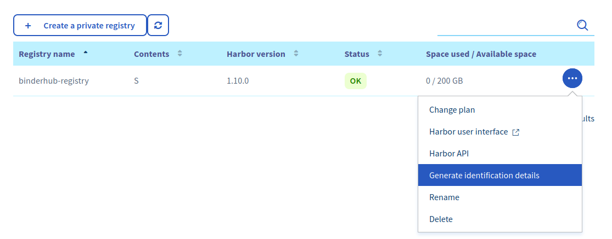
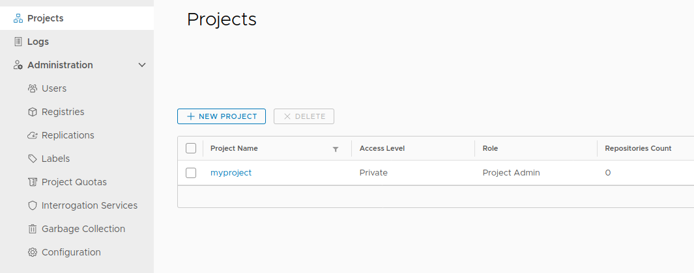

.. _setup-registry:

Set up the container registry
=============================

BinderHub will build Docker images out of Git repositories, and then push
them to a Docker registry so that JupyterHub can launch user servers based
on these images. You can use any registry that
you like, though this guide covers how to properly configure several popular
registries. The next step, :doc:`setup-binderhub`, explains how you can
properly configure BinderHub to use one of these registries.

.. _use-gcr:

Set up Google Container Registry
--------------------------------

To use Google Container Registry (``gcr.io``), you'll need to provide BinderHub
with proper credentials so it can push images. You can do so by creating a
service account that has authorization to push to Google Container Registry:

1. Go to `console.cloud.google.com`_
2. Make sure your project is selected
3. Click ``<top-left menu w/ three horizontal bars> -> IAM & Admin -> Service Accounts`` menu option
4. Click **Create service account**
5. Give your account a descriptive name such as "binderhub-builder"
6. Click ``Role -> Storage -> Storage Admin`` menu option
7. Click **Create Key**
8. Leave key type as default of **JSON**
9. Click **Create**

These steps will download a **JSON file** to your computer. The JSON file
contains the password that can be used to push Docker images to the ``gcr.io``
registry.

.. warning::

   Don't share the contents of this JSON file with anyone. It can be used to
   gain access to your google cloud account!

.. important::

   Make sure to store this JSON file as you cannot generate a second one
   without re-doing the steps above.

.. _use-docker-hub:

Set up Docker Hub registry
------------------------------

To use **Docker Hub** (``hub.docker.com``) as a registry first you have to create a
`Docker ID account <https://docs.docker.com/docker-id/>`_
in `Docker Hub <https://hub.docker.com/>`_. Your
Docker ID (username) and password are used to push Docker images to the registry.

If you want to store Docker images under an organization, you can
`create an organization <https://docs.docker.com/docker-hub/orgs/>`_.
This is useful if different Binder instances want to use same registry to store images.

.. _use-acr:

Set up Azure Container Registry
-------------------------------

To use Azure Container Registry (ACR), you'll need to provide BinderHub with proper credentials so it can push images.
You can do so by creating a `Service Principal <https://docs.microsoft.com/en-us/azure/active-directory/develop/app-objects-and-service-principals>`_ that has the `AcrPush <https://docs.microsoft.com/en-us/azure/role-based-access-control/built-in-roles#acrpush>`_ role.

This section uses the Azure command line.
Installation instructions can be found in the `Microsoft docs <https://docs.microsoft.com/en-us/cli/azure/install-azure-cli?view=azure-cli-latest>`_.

1. Login to your Azure account::

       az login

2. Select your chosen subscription::

       az account set -s <SUBSCRIPTION>

.. note::

   You can see which subscriptions you have available by running::

       az account list --refresh --output table

3. If you **do not** have a Resource Group, then create one::

       az group create --name <RESOURCE_GROUP_NAME> --location <RESOURCE_GROUP_LOCATION> --output table

where `<RESOURCE_GROUP_LOCATION>` refers to a data centre **region**.
See a list of regions `here <https://azure.microsoft.com/en-us/global-infrastructure/locations/>`_.

If you already have a Resource Group you'd like to use, then you can skip this step.

4. Create the ACR::

       az acr create --name <ACR_NAME> --resource-group <RESOURCE_GROUP_NAME> --sku Basic --output table

where:

* `<ACR_NAME>` must be between 5-50 alphanumeric characters and is unique to Azure.
  If you're not sure your chosen name is available, you can run `az acr check-name --name <ACR_NAME> --output table`.
* `--sku` is the pricing and capacity tier for the registry.
  See `this page <https://docs.microsoft.com/en-us/azure/container-registry/container-registry-skus>`_ for more details.

5. Login in the ACR::

       az acr login --name <ACR_NAME>

6. Note down the AppID of the ACR::

       az acr show --name <ACR_NAME> --query "id" -o tsv

We need this in order to assign the AcrPush role which will allow BinderHub to push images to the registry.
You can save this to a bash variable like so::

    ACR_ID=$(az acr show --name <ACR_NAME> --query "id" -o tsv)

7. Create a Service Principal with the AcrPush role assignment::

       az ad sp create-for-rbac --name <SP_NAME> --role AcrPush --scope <ACR_ID>

where:

* `<SP_NAME>` is a recognisable name for your Service Principal, for example `binderhub-sp`,
* `<ACR_ID>` is the AppID we retrieved in step 6 above.
  You can replace this with `${ACR_ID}` if you saved it to a bash variable.

.. important::

   Note down the AppID and password that are output by this step.
   These are the login credentials BinderHub will use to access the registry.

   **The password will not be recoverable after this step, so make sure you keep it safe!**

   If you'd like to save this info to bash variables, you can replace step 8 with the following commands::

       SERVICE_PRINCIPAL_PASSWORD=$(az ad sp create-for-rbac --name <SP_NAME> --role AcrPush --scopes <ACR_ID> --query password --output tsv)
       SERVICE_PRINCIPAL_ID=$(az ad sp show --id http://<SP_NAME> --query appId --output tsv)

Set up the OVH Container Registry
---------------------------------

To use the OVH Container Registry, log in to the `OVH Control Panel <https://www.ovh.com/manager/public-cloud>`_.

1. Click on **Managed Private Registry**

2. Click on the **Create a private registry** button

3. Select a **Region**, a **Name** for the registry and a **Plan**.

4. Generate the **Harbor identification details** to connect to the registry

  Generate the identification details to connect to
  the registry.

5. Then click on **Harbor API** to retrieve the URL of the registry

6. Log in to the Harbor Interface using the identification details, and create a new project:

  Create a new Harbor project.

7. The name of the project will be used when setting up the registry config in the next section

For more information about these steps, check out the `OVH Documentation <https://docs.ovh.com/gb/en/private-registry/creating-a-private-registry>`_

Next step
---------

Now that our cloud resources are set up, it's time to :doc:`setup-binderhub`.

.. _console.cloud.google.com: http://console.cloud.google.com
